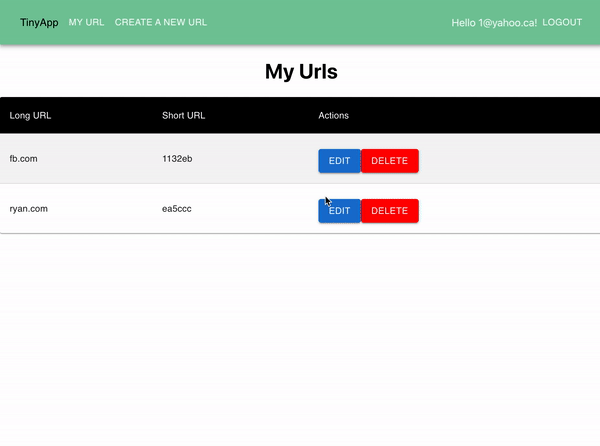

# tinyapp-2.0

Multi-page react application that allows to shorten long URLs. 

The project is similar to the tinyapp done at Lighthouse Labs, however the front-end is React and Typescript instead of EJS and Javascript. 

## App Demo 

# Features 
- Views the list of URL that you have shorten
- Creates a short verision of the URL 
- Updates the short URL to a new Long URL
- Deletes the unwanted URL  
- Users can log in or sign up to view their list of URL  

# Dependencies 
- React
- NodeJS 
- Express
- Typescript
- MaterialUI 
- Cookie-session 
- Axios 
- Cors
- React-Router-Dom
- Bcryptjs
- Postgres